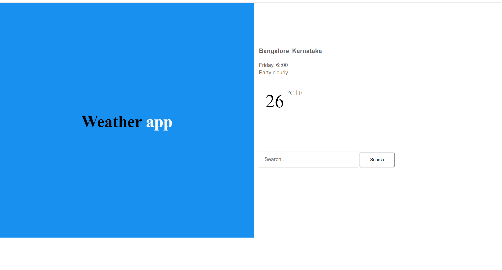
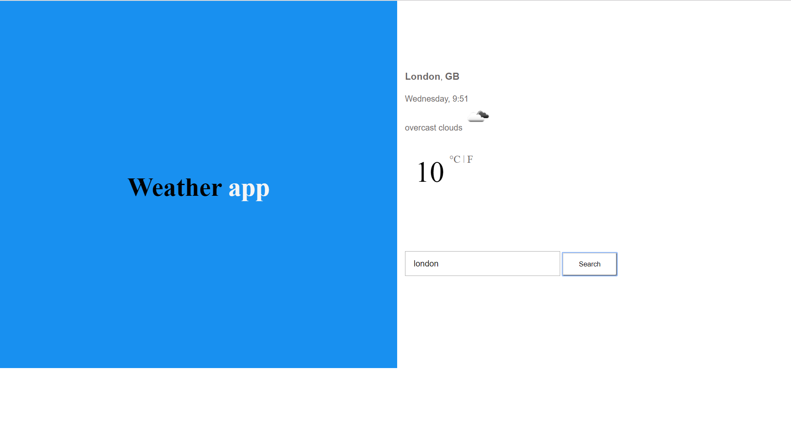
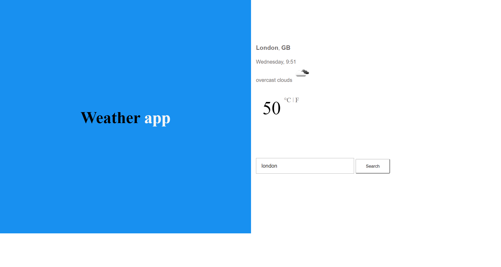

# Weather Application
The weather app assists you in finding the weather of any state or city in the world, in varied temperature 
calculations like Celsius and Fahrenheit. The app is programmed in such a way that you type the place and get the current accurate data.

# Getting Started
## How to use 
   Step1: The home screen is explicit, in such a way that you type the place and the temperature is displayed for you.
   
   
 
   Step 2: Type the name of the state or city in the text box given below and click the search button
   
   

   Step 3 : The temperature of the given city  will be displayed above the text box, which will be displayed in Celsius, 
   just click the F near to C and  get the temperature data in Fahrenheit 
   
   
   
   
   # Author
    VARUN
       
    
